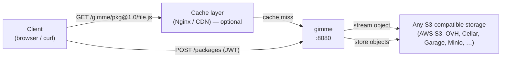
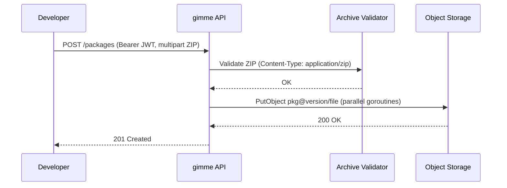
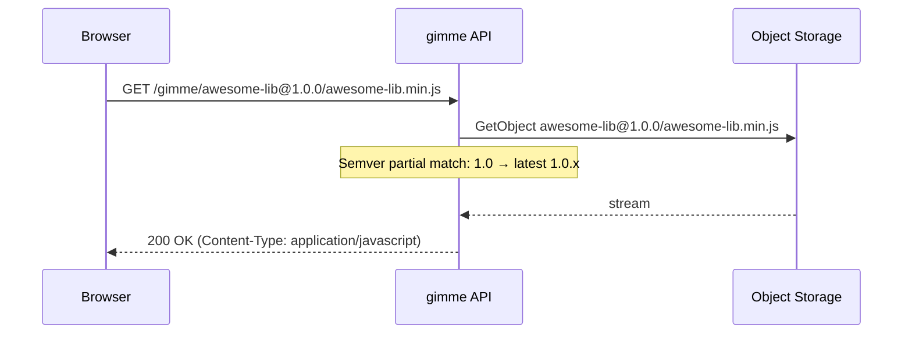

# gimme

[](https://go.dev)
[](https://hub.docker.com/r/ziggornif/gimme)
[](LICENSE)
[](https://github.com/gimme-cdn/gimme/actions/workflows/build.yml)

**A self-hosted CDN solution written in Go.**

Upload ZIP packages and serve static assets (JS, CSS, images, …) via a simple REST API, backed by **any S3-compatible object storage** — AWS S3, Google Cloud Storage, OVH Object Storage, Scaleway Object Storage, Clever Cloud Cellar, [Garage](https://garagehq.deuxfleurs.fr/), [Minio](https://min.io/), and more.

> **💡 A caching layer in front of gimme (e.g. Nginx, Varnish, Cloudflare) is strongly recommended for production use.**

---

## Table of Contents

- [Architecture](#architecture)
- [Quick Start](#quick-start)
- [Configuration](#configuration)
- [API Usage](#api-usage)
- [Deployment Examples](#deployment-examples)
- [Monitoring](#monitoring)

---

## Architecture

### Components


```mermaid
graph LR
    Client["Client\n(browser / curl)"]
    Gimme["gimme\n:8080"]
    S3["Any S3-compatible storage\n(AWS S3, OVH, Cellar, Garage, Minio, …)"]
    Cache["Cache layer\n(Nginx / CDN) — optional"]

    Client -->|"GET /gimme/pkg@1.0/file.js"| Cache
    Cache -->|cache miss| Gimme
    Gimme -->|stream object| S3
    Client -->|"POST /packages (JWT)"| Gimme
    Gimme -->|store objects| S3
```

### Upload flow


```mermaid
sequenceDiagram
    participant Dev as Developer
    participant API as gimme API
    participant Val as Archive Validator
    participant S3 as Object Storage

    Dev->>API: POST /packages (Bearer JWT, multipart ZIP)
    API->>Val: Validate ZIP (Content-Type: application/zip)
    Val-->>API: OK
    API->>S3: PutObject pkg@version/file (parallel goroutines)
    S3-->>API: 200 OK
    API-->>Dev: 201 Created
```

### Serve flow


```mermaid
sequenceDiagram
    participant Browser
    participant API as gimme API
    participant S3 as Object Storage

    Browser->>API: GET /gimme/awesome-lib@1.0.0/awesome-lib.min.js
    API->>S3: GetObject awesome-lib@1.0.0/awesome-lib.min.js
    Note over API: Semver partial match: 1.0 → latest 1.0.x
    S3-->>API: stream
    API-->>Browser: 200 OK (Content-Type: application/javascript)
```

---

## Quick Start

### With a managed S3 provider (AWS, R2, Scaleway, …)

Gimme works with any S3-compatible provider. Just fill in `gimme.yml` with your credentials:

```yaml
s3:
  url: s3.amazonaws.com          # or s3.fr-par.scw.cloud, s3.gra.io.cloud.ovh.net, cellar-c2.services.clever-cloud.com, …
  key: your-access-key
  secret: your-secret-key
  bucketName: gimme
  location: eu-west-1            # region as defined by your provider
  ssl: true
```

Then run:

```bash
cp gimme.example.yml gimme.yml
# Edit gimme.yml with your credentials
make build && ./gimme
```

> See [with-managed-s3/](examples/deployment/docker-compose/with-managed-s3/) for a ready-to-use Docker Compose example.

### With Garage (self-hosted S3)

If you also want to self-host the object storage, [Garage](https://garagehq.deuxfleurs.fr/) is a lightweight S3-compatible store that runs alongside gimme. The stack provisions itself automatically — no manual setup needed.

```bash
cd examples/deployment/docker-compose/with-garage
docker compose up -d
```

Gimme will be available at <http://localhost:8080>.  
The `init-garage` service creates the bucket and writes the config automatically.

> See [with-garage/README.md](examples/deployment/docker-compose/with-garage/README.md) for configuration details.

### With Minio (local dev)

```bash
cd examples/deployment/docker-compose/with-local-s3
docker compose up -d
```

> You must create an access key / secret from the Minio admin console at <http://localhost:9001> and update `gimme.yml` accordingly.

### From source

```bash
# Requires Go 1.26+ and a running S3-compatible backend
cp gimme.example.yml gimme.yml
# Edit gimme.yml with your S3 credentials
make build
./gimme
```

---

## Configuration

Configuration is read from `gimme.yml` (local directory or `/config/gimme.yml` in Docker).  
Environment variables override file values automatically (via [Viper](https://github.com/spf13/viper)).

```yaml
admin:
  user: gimmeadmin
  password: gimmeadmin
port: 8080
secret: your-jwt-signing-secret
s3:
  url: your.s3.endpoint
  key: your-access-key
  secret: your-secret-key
  bucketName: gimme
  location: garage          # use region name matching your backend
  ssl: false                # set true for remote/production backends
# metrics: true             # optional — expose /metrics (Prometheus), defaults to true
```

| Key               | Description                              | Default  |
|-------------------|------------------------------------------|----------|
| `secret`          | JWT signing secret                       | required |
| `admin.user`      | Admin username (Basic Auth)              | required |
| `admin.password`  | Admin password (Basic Auth)              | required |
| `port`            | HTTP server port                         | `8080`   |
| `s3.url`          | S3 / Garage endpoint URL                 | required |
| `s3.key`          | S3 access key                            | required |
| `s3.secret`       | S3 secret key                            | required |
| `s3.bucketName`   | Bucket name                              | `gimme`  |
| `s3.location`     | S3 region / Garage zone                  | required |
| `s3.ssl`          | Enable TLS for S3 connection             | `true`   |
| `metrics`         | Enable `/metrics` OpenMetrics endpoint   | `true`   |

---

## API Usage

### 1. Create an access token

Use your `admin.user` / `admin.password` as HTTP Basic Auth credentials:

```bash
curl -s -X POST http://localhost:8080/create-token \
  -u gimmeadmin:gimmeadmin \
  -H 'Content-Type: application/json' \
  -d '{"name": "my-token", "expirationDate": "2027-12-31"}'
```

Response:
```json
{"token": "eyJhbGciOiJIUzI1NiIsInR5cCI6IkpXVCJ9..."}
```

> If `expirationDate` is omitted, the token expires in **15 minutes**.

### 2. Upload a package

A package is a ZIP archive. The `name` and `version` fields identify it in the CDN.

```bash
curl -s -X POST http://localhost:8080/packages \
  -H 'Authorization: Bearer <token>' \
  -F 'file=@awesome-lib.zip' \
  -F 'name=awesome-lib' \
  -F 'version=1.0.0'
```

Response: `201 Created`

### 3. Serve a file

Once uploaded, files are served at:

```
GET /gimme/<package>@<version>/<file>
```

```bash
curl http://localhost:8080/gimme/awesome-lib@1.0.0/awesome-lib.min.js
```

**Semver partial versions are supported** — `awesome-lib@1.0` resolves to the latest `1.0.x` available.

Use it directly in HTML:

```html
<link rel="stylesheet" href="http://localhost:8080/gimme/awesome-lib@1.0.0/awesome.min.css">
<script src="http://localhost:8080/gimme/awesome-lib@1.0.0/awesome-lib.min.js" type="module"></script>
```

### 4. Browse package contents

```
GET /gimme/<package>@<version>
```

Returns an HTML page listing all files in the package.

```bash
# macOS
open http://localhost:8080/gimme/awesome-lib@1.0.0
# Linux
xdg-open http://localhost:8080/gimme/awesome-lib@1.0.0
```

### 5. Delete a package

```bash
curl -s -X DELETE http://localhost:8080/packages/awesome-lib@1.0.0 \
  -H 'Authorization: Bearer <token>'
```

Response: `204 No Content`

> **CORS:** All routes include CORS headers with permissive defaults (`Access-Control-Allow-Origin: *`). This means you can load assets from gimme directly in a browser without any proxy configuration.

### API routes summary

| Method   | Route                        | Auth       | Description                          |
|----------|------------------------------|------------|--------------------------------------|
| `GET`    | `/`                          | —          | HTML homepage                        |
| `POST`   | `/create-token`              | Basic Auth | Create a JWT access token            |
| `POST`   | `/packages`                  | Bearer JWT | Upload a ZIP package                 |
| `DELETE` | `/packages/:package`         | Bearer JWT | Delete a package (`name@version`)    |
| `GET`    | `/gimme/:package`            | —          | List files in a package (HTML)       |
| `GET`    | `/gimme/:package/*file`      | —          | Serve a file from a package          |
| `GET`    | `/metrics`                   | —          | Prometheus / OpenMetrics endpoint    |
| `GET`    | `/docs`                      | —          | Interactive API documentation        |
| `GET`    | `/healthz`                   | —          | Liveness probe                       |
| `GET`    | `/readyz`                    | —          | Readiness probe (checks S3 bucket)   |

---

## Deployment Examples

The [`examples/deployment`](examples/deployment) directory contains ready-to-use configurations:

| Stack                       | Path                                                         | Description                                              |
|-----------------------------|--------------------------------------------------------------|----------------------------------------------------------|
| Docker Compose + managed S3 | [`with-managed-s3/`](examples/deployment/docker-compose/with-managed-s3/) | gimme + any cloud S3 provider (AWS, OVH, Scaleway, Cellar, …) |
| Docker Compose + Garage     | [`with-garage/`](examples/deployment/docker-compose/with-garage/) | Self-provisioning stack with self-hosted Garage + monitoring |
| Docker Compose + Minio      | [`with-local-s3/`](examples/deployment/docker-compose/with-local-s3/) | Local dev stack with Minio + monitoring              |
| Kubernetes                  | [`kubernetes/`](examples/deployment/kubernetes/)             | Namespace, Deployment, Service, Ingress                  |
| systemd                     | [`systemd/`](examples/deployment/systemd/)                   | Linux systemd unit file                                  |

### Docker — single container

```bash
docker run -p 8080:8080 \
  -v "$(pwd)/gimme.yml:/config/gimme.yml" \
  ziggornif/gimme:latest
```

### HTTP Cache-Control headers

Gimme automatically emits `Cache-Control` headers on every file response:

| Version type | Example | Header |
|---|---|---|
| Pinned (3-part semver) | `pkg@1.0.0` | `public, max-age=31536000, immutable` |
| Partial | `pkg@1.0` or `pkg@1` | `public, max-age=300` |
| Not found (404) | any | `no-store` |

Pinned versions are **immutable by design** — a `pkg@1.0.0` URL always resolves to the exact same files, so browsers and proxies can cache them for up to 1 year without revalidation.

Partial versions (e.g. `pkg@1.0`) resolve to the latest matching patch at request time, so they are only cached for 5 minutes.

### Cache with Nginx

Add a Nginx reverse proxy with caching in front of gimme. Nginx will respect the `Cache-Control` headers emitted by gimme and cache responses accordingly.

```yaml
services:
  nginx:
    image: nginx:alpine
    volumes:
      - ./nginx.conf:/etc/nginx/nginx.conf
    ports:
      - "80:80"
  gimme:
    image: ziggornif/gimme:latest
    volumes:
      - ./gimme.yml:/config/gimme.yml
```

`nginx.conf`:
```nginx
events {}
http {
  proxy_cache_path /cache levels=1:2 keys_zone=CDN:10m inactive=24h max_size=1g;
  server {
    listen 80;

    location /gimme/ {
      proxy_pass         http://gimme:8080;
      proxy_cache        CDN;
      # respect Cache-Control headers emitted by gimme:
      # - pinned versions (pkg@1.0.0) → immutable, cached up to 1 year
      # - partial versions (pkg@1.0)  → cached 5 minutes
      # - errors / 404               → no-store, never cached
      proxy_cache_valid  200 1y;
      proxy_buffering    on;
    }

    location / {
      proxy_pass http://gimme:8080;
    }
  }
}
```

### Cache with Caddy

Standard Caddy does **not** cache by default — it requires the [`cache-handler`](https://github.com/caddyserver/cache-handler) plugin (available in [Caddy with plugins](https://caddyserver.com/download)).

Once the plugin is compiled in, Caddy respects `Cache-Control` headers automatically:

```caddy
:80 {
  route /gimme/* {
    cache
    reverse_proxy gimme:8080
  }

  reverse_proxy gimme:8080
}
```

Without the plugin, Caddy acts as a plain reverse proxy and forwards all requests to gimme with no caching.

### Cache with Varnish

```vcl
vcl 4.1;

backend gimme {
  .host = "gimme";
  .port = "8080";
}

sub vcl_backend_response {
  # cache based on Cache-Control sent by gimme
  if (beresp.http.Cache-Control ~ "immutable") {
    set beresp.ttl = 365d;
  } else if (beresp.http.Cache-Control ~ "max-age=300") {
    set beresp.ttl = 5m;
  } else {
    # no-store: do not cache
    set beresp.uncacheable = true;
    set beresp.ttl = 0s;
  }
}
```

---

## Monitoring

Each gimme instance exposes a `/metrics` endpoint in [OpenMetrics](https://openmetrics.io/) format, compatible with Prometheus.

A pre-configured Prometheus + Grafana stack is included in the Docker Compose examples.  
See [`examples/monitoring/`](examples/monitoring/) for the Prometheus config and Grafana dashboard.

Access:
- Prometheus: <http://localhost:9090>
- Grafana: <http://localhost:3000> (anonymous access enabled in the example)
